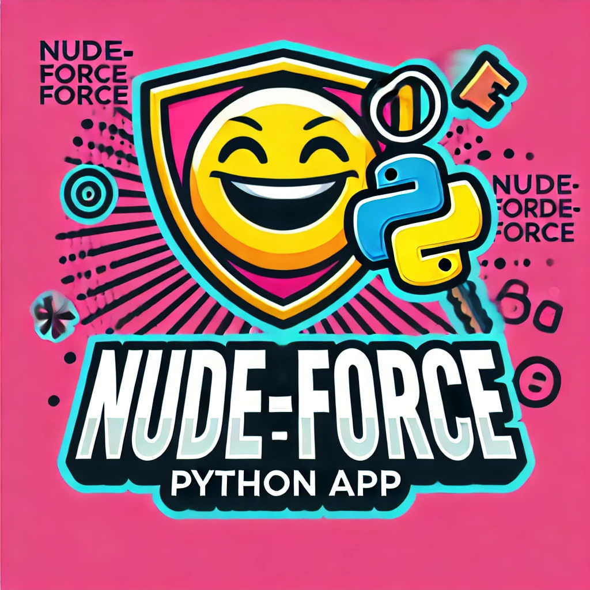
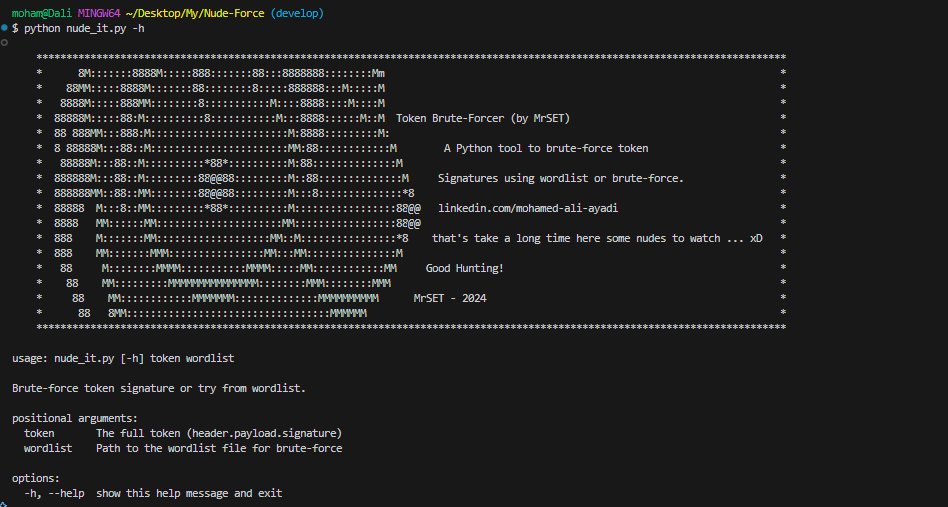

# Nude-Force Token Signature Script

This script attempts to brute-force a token signature by using a wordlist first and then falling back to brute-forcing with a defined character set. The script is useful for testing and auditing purposes, especially when analyzing token security.



## Features
- Compute token signatures using HMAC-SHA256.
- Try a wordlist of keys first for quick matches.
- Fall back to brute-forcing keys using a customizable character set and key length range.
- Real-time progress updates.

## Requirements
- Python 3.x
- No external dependencies (uses Python's standard library).

## Installation
1. Clone this repository:
   ```bash
   git clone <repository_url>
   cd <repository_directory>
   ```

2. Create a Python virtual environment (optional but recommended):
   ```bash
   python3 -m venv venv
   source venv/bin/activate   # On Windows: venv\Scripts\activate
   ```

3. Install requirements (if additional dependencies are added in the future):
   ```bash
   pip install -r requirements.txt
   ```

## Usage



To use the script, run the following command:
```bash
python nude_it.py <token> <wordlist>
```

### Arguments
- `<token>`: The full token in the format `header.payload.signature`.
- `<wordlist>`: Path to the wordlist file to use for brute-forcing.

### Example
```bash
python nude_it.py eyJhbGciOiJIUzI1NiIsInR5cCI6IkpXVCJ9.eyJzdWIiOiIxMjM0NTY3ODkwIiwibmFtZSI6IkpvaG4gRG9lIiwiaWF0IjoxNTE2MjM5MDIyfQ.signature /path/to/wordlist.txt
```

## How It Works
1. **Wordlist Attack**: The script first attempts to find the key using the provided wordlist. For each word in the wordlist, it computes the signature and compares it to the given token signature.
2. **Brute-Force Attack**: If the wordlist fails, the script falls back to a brute-force attack, generating keys of increasing lengths from the defined character set.

### Key Parameters
- **Character Set**: The default character set is `A-Z`, `a-z`, and `0-9`. You can modify it in the script:
  ```python
  charset = "ABCDEFGHIJKLMNOPQRSTUVWXYZabcdefghijklmnopqrstuvwxyz0123456789"
  ```
- **Key Length Range**: The script attempts key lengths from 5 to 32 characters by default. You can adjust this:
  ```python
  key_length_range = range(5, 33)
  ```

### Progress Updates
- The script provides real-time progress updates, showing the number of attempts, time spent, and estimated remaining time.

## Output
- If a key is found, the script outputs:
  ```bash
  Key found: <key> | Total attempts: <attempt_count> | Time taken: <time_minutes> minutes
  ```
- If no key is found, it outputs:
  ```bash
  Key not found.
  ```

## Limitations
- **Performance**: Brute-forcing is computationally intensive. The time required grows exponentially with the key length and size of the character set.
- **Token Validation**: This script does not validate the payload; it only brute-forces the signature.

## Legal Disclaimer
This script is intended for educational purposes and security testing on systems you own or have explicit permission to test. Unauthorized use is illegal and unethical.

## Contributing
Contributions are welcome! Feel free to open issues or submit pull requests.

## License
This project is licensed under the MIT License. See the `LICENSE` file for details.

